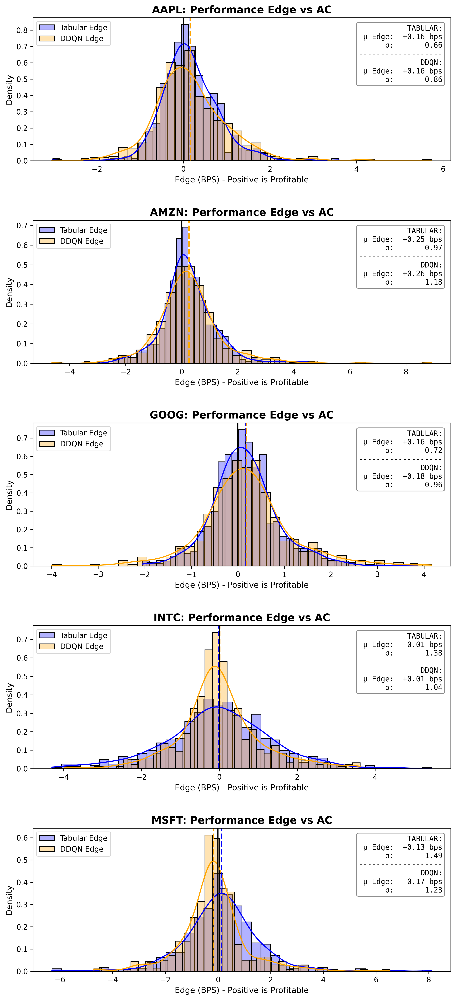

# Optimal Trade Execution via Reinforcement Learning: Tabular vs. DDQN


## 📌 Project Summary
This project builds a custom Reinforcement Learning (RL) environment to solve the Optimal Trade Execution problem. The objective is to autonomously liquidate a large position of shares within a compressed time horizon while minimizing market impact and execution costs (slippage). 

The system leverages real-world historical Limit Order Book (LOB) data across major equities to train and rigorously evaluate two distinct RL agents:
1. **A Tabular Q-Learning Agent** utilizing discrete state-space bucketing.
2. **A Double Deep Q-Network (DDQN)** utilizing continuous, normalized state spaces.

The performance of both models is benchmarked head-to-head against industry-standard execution algorithms: the **Almgren-Chriss (AC)** model and **Time-Weighted Average Price (TWAP)**.

### 🚀 Key Research Highlights
* **Empirical LOB Microstructure:** Unlike standard academic environments that rely on simulated price paths and theoretical slippage formulas, this project calculates exact execution costs by physically "walking the order book" across five mega-cap equities (AAPL, AMZN, GOOG, INTC, MSFT).
* **Solving the "Blind AI" Problem:** Standard RL execution agents fail in highly liquid real-world markets because they are punished for adverse price drops they cannot foresee. To fix this, this project engineers custom predictive features—**Order Book Imbalance** and **Rolling Autocorrelation**—giving the AI the directional awareness needed to predict short-term momentum and dynamically adjust its execution speed.
---

## 📊 Key Results & Performance

The models were evaluated strictly on their relative **Execution Edge (in basis points)** against the mathematically optimal AC trajectory and TWAP. A positive improvement percentage indicates the agent successfully out-traded the benchmark, saving execution costs.

*Note: The performance matrix below represents **in-sample convergence metrics**. The objective of this phase is to prove the RL agents can successfully learn LOB dynamics and out-trade static baselines on known historical distributions. Future project extensions will involve strict out-of-sample forward-testing.*

### Model Comparison Matrix
| Ticker | Model | GLR | P[ΔP&L > 0] | Std. | Mean RL | Improv. vs AC | Mean AC | Mean TWAP |
| :--- | :--- | :--- | :--- | :--- | :--- | :--- | :--- | :--- |
| **AAPL** | Tabular | 1.46 | 57.4% | 0.66 | -0.80 bps | +16.60% | -0.95 bps | -0.90 bps |
| | DDQN | 1.19 | 58.8% | 0.91 | -0.78 bps | +18.74% | - | - |
| | **WINNER** | **Tabular** | **DDQN** | **-** | **DDQN** | **DDQN** | | |
| | | | | | | | | |
| **AMZN** | Tabular | 1.40 | 60.0% | 0.97 | -1.81 bps | +11.97% | -2.06 bps | -1.99 bps |
| | DDQN | 1.18 | 55.4% | 1.33 | -1.49 bps | +27.32% | - | - |
| | **WINNER** | **Tabular**| **Tabular** | **-** | **DDQN** | **DDQN** | | |
| | | | | | | | | |
| **GOOG** | Tabular | 1.36 | 57.8% | 0.72 | -1.02 bps | +13.76% | -1.18 bps | -1.11 bps |
| | DDQN | 1.53 | 61.8% | 0.88 | -0.32 bps | +72.92% | - | - |
| | **WINNER** | **DDQN** | **DDQN** | **-** | **DDQN** | **DDQN** | | |
| | | | | | | | | |
| **INTC** | Tabular | 1.00 | 49.2% | 1.38 | -2.02 bps | -0.72% | -2.00 bps | -1.91 bps |
| | DDQN | 1.14 | 46.6% | 1.13 | -2.65 bps | -32.06% | - | - |
| | **WINNER** | **DDQN** | **Tabular** | **-** | **Tabular** | **Tabular** | | |
| | | | | | | | | |
| **MSFT** | Tabular | 1.01 | 56.0% | 1.49 | -2.13 bps | +5.78% | -2.26 bps | -2.17 bps |
| | DDQN | 1.15 | 45.0% | 1.13 | -2.31 bps | -2.16% | - | - |
| | **WINNER** | **DDQN** | **Tabular** | **-** | **Tabular** | **Tabular** | | |

### Edge Distribution Analysis



### 🔍 Quantitative Performance & Distribution Analysis
The empirical results and distribution plots reveal a distinct divergence between the two RL architectures, highlighting the quantitative tradeoff between absolute consistency and fat-tail edge extraction.

**1. The DDQN: Fat-Tail Dynamics and Momentum Dominance**

On highly volatile, fluid order books (GOOG, AMZN, AAPL), the DDQN's continuous state space proves superior at extracting absolute edge. On **GOOG**, the DDQN completely dominates, boasting a **61.8%** win rate, a **1.53** GLR, and a massive **+72.92%** mean improvement over the baseline. 
However, looking at the distribution plots, the DDQN typically exhibits a wider standard deviation. While its day-to-day median performance can be noisy, its continuous architecture allows it to perfectly time massive, highly profitable momentum sweeps that heavily skew the overall distribution (fat right tails). It sacrifices a bit of consistency for explosive outlier outperformance.

**2. The Tabular Agent: The High-Probability Stabilizer**

While the DDQN hunts for massive momentum edges, the Tabular agent remains the master of consistency and risk aversion. Visually, the Tabular agent's distributions are tighter and more reliably shifted to the right of the zero-line. By discretizing the LOB state space, the Tabular model effectively acts as a low-pass filter against high-frequency market noise. 
This proved critical on **MSFT** and **AMZN**, where the Tabular agent secured highly stable win probabilities (56.0% and 60.0%, respectively). When the DDQN became too aggressive on MSFT and posted a negative improvement (-2.16%), the conservative Tabular agent safely navigated the noise to pull a +5.78% edge. 

**3. The Microstructure Trap: INTC**

Both agents consistently fail to produce a positive edge on **INTC**, posting negative improvement scores and win rates below 50%. In the distribution plots, this is visible as a clear leftward shift for both models compared to the TWAP baseline. 
This is not an algorithm failure; it is a vital microstructure anomaly. Intel (INTC) operates with a notably thicker, slower-moving limit order book compared to the other mega-cap tickers. In a compressed 8-minute execution window, a thick book suppresses the short-term directional momentum signals the agents rely on. When predictive signals decay to random noise, actively deviating from the TWAP baseline purely incurs spread-crossing costs. This empirically proves that in ultra-low volatility regimes, static execution remains mathematically optimal.

## 📂 Repository Structure
The codebase is modularized into environment definitions, agent architectures, and execution scripts to ensure easy replication and extension.

```text
├── data/                
├── src/             
│   ├── agent_ddqn.py     
│   ├── agent_tabular.py    
│   ├── baseline_ac.py      
│   ├── data_loader.py   
│   └── environment.py    
├── models/        
├── results/        
├── main.py          
├── utils.py  
├── requirements.txt      
└── README.md
```

## 📈 Dataset & High-Frequency Microstructure

The models are trained and evaluated on highly granular historical Limit Order Book (LOB) data for five major mega-cap equities: **AAPL, AMZN, GOOG, INTC, and MSFT**. 

Rather than relying on theoretical market simulations or synthetic price generation, this environment replays actual historical LOB snapshots. This forces the agents to navigate real-world microstructure phenomena—such as transient liquidity voids, sudden spread widening, and order book imbalances—at a high-frequency resolution. 

**Chronological Integrity:** The environment strictly enforces forward-stepping time dynamics. Within any given episode, the agent only ever receives trailing state data (e.g., historical rolling autocorrelation) and has zero look-ahead access to future order book states or price ticks.

---
## 🕹️ The RL Execution Environment

The custom environment (`ExecutionEnvironment`) simulates the mechanics of liquidating a large block of shares. To stress-test the agents in a noisy microstructure setting, the execution horizon is heavily compressed into **8 execution steps** over an 8-minute trading window.

### Action Space (TWAP Multipliers)
The agent does not output raw share amounts. Instead, it selects a discrete multiplier $\beta$ applied to a standard Time-Weighted Average Price (TWAP) baseline trade. 
* **Baseline Trade:** $Q_{baseline} = \text{Total Shares} / T$
* **Execution Amount:** $Q_{buy} = \beta \times Q_{baseline}$
* **Action Space:** $\beta \in \\{0.5, 0.6, \dots, 1.0, \dots, 1.4, 1.5\\}$ (Where an action of `1.0` exactly matches the TWAP trajectory).

### Reward Function: Walking the Book & Inventory Risk
Standard academic models (like Almgren-Chriss) rely on theoretical formulas to estimate temporary and permanent market impact. Because this environment uses highly liquid, real-world data, theoretical impact models often clash with reality. 

Instead, this project calculates exact empirical slippage by literally **"walking the order book"**—consuming the available volume at each ask price level until the order slice $Q_{buy}$ is filled.

The step reward is carefully shaped to balance immediate execution costs against ongoing market exposure. It is the negative sum of two specific penalties, normalized into basis points (bps) against the ideal arrival cost:

**1. Slippage Penalty ($S_t$)**
The immediate cost of crossing the spread and absorbing liquidity compared to the theoretical mid-price.

$$S_t = \text{Actual LOB Cost} - (Q_{buy} \times \text{MidPrice}_t)$$

**2. Inventory Penalty ($I_t$)**
The market risk of holding unexecuted shares. If the price moves adversely while the agent holds inventory, it incurs a massive penalty. This is the core mechanism that forces the AI to pay attention to the Momentum and Imbalance features.

$$I_t = \text{Remaining Inventory}_{t+1} \times (\text{MidPrice}_t - \text{MidPrice}_{t-1})$$

**3. Total Step Reward ($R_t$)**
The raw step cost is the sum of slippage and inventory risk. To stabilize neural network gradients across fundamentally different stocks, this raw cost is normalized by the total ideal arrival cost (Total Shares $\times$ Initial MidPrice) and converted into basis points.

$$R_t = - \left( \frac{S_t + I_t}{\text{Total Ideal Cost}} \right) \times 10000$$

*(By benchmarking against the ideal arrival cost at $t=0$, the AI's objective is mathematically aligned with standard quantitative execution metrics: minimize Implementation Shortfall).*

### State Space 
To ensure the neural network learns stably without gradient explosions, the entire 6-dimensional state space is strictly normalized into a `[-1.0, 1.0]` range before being fed into the DDQN. 

Before normalization, the features represent the following raw market dynamics:

1. **Time Elapsed**: The current step in the episode (e.g., `[0, 8]` steps). It dictates the agent's execution urgency. As time runs out, the agent must trade more aggressively to ensure all shares are sold.
2. **Inventory Remaining**: The raw number of shares left to execute (e.g., `[0, Total Shares]`). This defines the agent's market risk exposure. Holding too much inventory for too long exposes the agent to massive penalties if the price drops.
3. **Spread**: The current bid-ask spread, tracked as a historical percentile `[0.0, 1.0]`. It tells the agent the immediate cost of trading. A high value (near 1.0) means the spread is unusually wide and trading right now will be very expensive.
4. **Ask Volume**: The shares available at the best asking price, also tracked as a historical percentile `[0.0, 1.0]`. It measures liquidity depth. A low value means there aren't many shares available, so a large market order will cause high slippage.
5. **Order Book Imbalance**: The ratio of buyers to sellers at the top of the book, naturally ranging from `[-1.0, 1.0]`. It represents which side is currently stronger. If the value is `< 0`, the ask side is heavier (more sellers), suggesting the price is about to fall.
6. **Autocorrelation**: The rolling correlation of recent price changes `[-1.0, 1.0]`. To enable the agent to predict the trend on the next timestep. A positive value means the current price trend is strong and likely to continue, while a negative value suggests the trend is just noise and about to reverse.

## 🚧 Challenges & Architectural Evolution
Building an RL agent on raw, high-frequency limit order book data presented several severe challenges that required pivoting away from standard academic assumptions.

### 1. The Theoretical vs. Empirical Disconnect (Pivoting from AC to TWAP)
Initially, the environment was built around the Almgren-Chriss (AC) framework. However, a major conflict arose when testing on real-world dataset. The AC model assumes a theoretical permanent/temporary market impact (slippage) based on execution speed. But because this project evaluates on real LOB data, I simulated slippage by literally *walking the order book*. 
* **The Problem:** Mega-cap tech stocks (AAPL, MSFT) are highly liquid and resilient. The actual volume is so rich that walking the book results in incredibly small slippage compared to the AC model's theoretical drop. Forcing the AI to follow the AC trajectory while calculating real LOB slippage caused highly unstable learning. 
* **The Solution (Pivoting to TWAP):** I pivoted to using **TWAP (Time-Weighted Average Price)** as the primary baseline and trajectory anchor. In a highly liquid mega-cap market with a compressed 8-minute trading horizon, the price drift between micro-steps ($\tau$) is incredibly small, and the available volume is rich. Consequently, evenly distributing the order over time (TWAP) is the near-optimal solution for minimizing impact, making it an exceptionally difficult and realistic baseline for the RL agents to beat.

### 2. The "Blind AI" Problem (Aligning State Space with Reward Shaping)
To force the AI to execute intelligently, I modified the reward logic to heavily penalize *inventory risk*—meaning the AI received a massive penalty if the price moved adversely while holding unexecuted shares.
* **The Problem:** Performance actually tanked. The AI became entirely confused because it was being punished for price drops, but its state space (just time, spread, and volume) gave it no mathematical way to *predict* those drops. It was a partially observable environment where the AI was effectively guessing.
* **The Solution:** I engineered two specific features to give the AI "eyes":
  1. **Order Book Imbalance (Momentum):** Allows the AI to see whether buyers or sellers are currently dominating the micro-step.
  2. **Rolling Autocorrelation:** Allows the AI to predict if the current momentum is a mean-reverting blip or a continuing trend.
* **The Result:** Once the AI could mathematically correlate the Autocorrelation state with the Inventory Risk reward, performance stabilized, and the models began successfully outperforming the TWAP baseline.


## 🧠 Model Architectures
### 1. Tabular Q-Learning Agent
* **State Discretization (5 Features):** Converts continuous financial variables into fixed, discrete buckets to construct a finite Q-Table. The state space consists of five core features: **Spread, Time, Inventory, Volume, and Momentum**.
* **Update Rule:** Instead of a standard forward-stepping epsilon-greedy exploration strategy, this model utilizes **Backward Induction**. Because the optimal execution problem has a fixed, finite time horizon (the trading window strictly ends at $T$), the agent computes the optimal policy by stepping backward from the terminal state, ensuring mathematically rigorous convergence for the discrete state-action pairs.
* **Advantage:** Highly interpretable, entirely deterministic once solved, and immune to the gradient instability that plagues deep learning models in noisy high-frequency environments.

### 2. Double Deep Q-Network (DDQN)
* **Continuous State Space (6 Features):** Unlike the tabular model, the DDQN processes a strictly normalized `[-1.0, 1.0]` continuous state array. It utilizes six features: **Spread, Time, Inventory, Volume, Momentum, AND Autocorrelation**. 
* **Architecture:** Implemented in PyTorch. A lightweight Multi-Layer Perceptron (MLP) utilizing a target network to evaluate the greedy policy dictated by the primary network. This eliminates the maximization bias (overestimation of Q-values) common in standard DQN algorithms.
* **Advantage of the DDQN:** The primary advantage of the DDQN is its ability to natively handle **continuous, high-dimensional state spaces**. While the Tabular agent suffers from the "curse of dimensionality" (adding Autocorrelation would cause the Q-table size to explode exponentially), the DDQN scales effortlessly. By not forcing the data into rigid discrete buckets, the neural network learns a much more generalized, fluid trading policy that adapts smoothly to unseen market micro-states.


### Key Hyperparameters & Configuration
To ensure full reproducibility, the agents were trained using the following core configurations. *(Note: Extensive hyperparameter tuning was required to stabilize the DDQN given the high noise-to-signal ratio of LOB data).*

**Execution Environment:**
* **Trading Horizon ($T$):** 8 execution steps
* **Step Interval ($\tau$):** 60 seconds per step
* **Action Space:** 11 discrete TWAP multipliers `[0.5x, 0.6x, ..., 1.5x]`

**Tabular Q-Learning Agent:**
* **Discount Factor ($\gamma$):** `1.0` *(Optimizing for total trajectory cost via finite-horizon backward induction)*
* **Training Episodes:** `15,000`
* **State Space Discretization (Buckets):**
  * Inventory: 16 bins
  * Momentum: 10 bins
  * Spread: 5 bins
  * Volume: 5 bins
  * *(Time is inherently discrete across the 8 steps)*

**Double Deep Q-Network (DDQN):**
* **Learning Rate ($\alpha$):** `2.5e-4`
* **Discount Factor ($\gamma$):** `0.99` *(Bounded to prevent Q-value explosion)*
* **Target Update Frequency:** `2000`
* **Batch Size:** `64`
* **Replay Buffer Capacity:** `100,000` transitions
* **Epsilon Decay:** `0.9998`
* **Training Episodes:** `50,000`

---
## ⚙️ Installation & Requirements
This project requires Python 3.8+ and PyTorch. 

1. Clone the repository:
```bash
git clone [https://github.com/eddiesung111/optimal-trade-execution-rl.git](https://github.com/eddiesung111/optimal-trade-execution-rl.git)
cd optimal-trade-execution-rl
```

2. Create a virtual environment (recommended):
```bash
python3 -m venv venv
source venv/bin/activate
```

3. Install the required dependencies:
```bash
pip3 install -r requirements.txt
```

## 🚀 How to Run
### Training the Agents
You can train either the Tabular or DDQN agent from scratch using the main execution script.

```bash
# Train the Tabular Q-Learning model
python3 main.py --agent tabular --mode train

# Train the DDQN model
python3 main.py --agent ddqn --mode train
```

### Evaluating & Generating Reports
Once the models are trained, run the evaluation suite to benchmark them against the Almgren-Chriss and TWAP baselines across the exact same market trajectories.
```bash
# Test the two models
python3 main.py --agent tabular --mode test
python3 main.py --agent ddqn --mode test

# Generate the Gain-Loss Ratio CSV and the distribution plots
python3 utils.py
```

---
## 📚 References
This project adapts, modifies, and expands upon the theoretical frameworks and experimental designs presented in the following foundational quantitative finance literature:

1. **Hendricks, D., & Wilcox, D. (2014).** *"A reinforcement learning extension to the Almgren-Chriss framework for optimal trade execution."* 2014 IEEE Conference on Computational Intelligence for Financial Engineering & Economics (CIFEr), pp. 457-464. 
   * [View on IEEE Xplore](https://ieeexplore.ieee.org/document/6924109/) | [View on arXiv](https://arxiv.org/abs/1403.2229)

2. **Ning, B., Lin, F. H. T., & Jaimungal, S. (2020).** *"Double Deep Q-Learning for Optimal Execution."* Applied Mathematical Finance, arXiv:1812.06600. 
   * [View on arXiv](https://arxiv.org/abs/1812.06600)

## ⚠️ Disclaimer
For Educational and Research Purposes Only. The code, models, and data provided in this repository do not constitute financial advice, investment recommendations, or trading signals. Quantitative trading in live markets carries significant financial risk. The models herein were evaluated on historical data and are not guaranteed to perform similarly in live, forward-tested market conditions.
